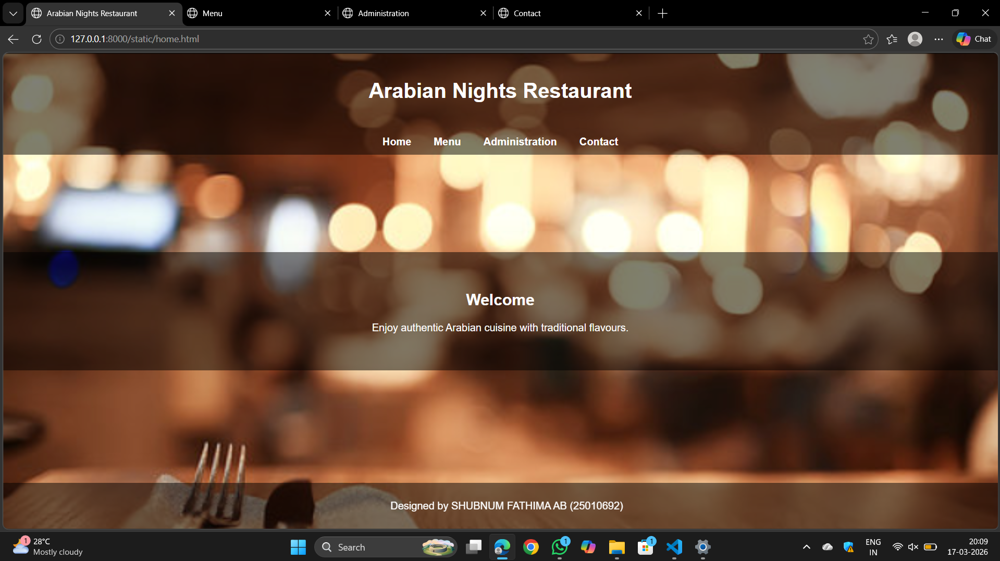
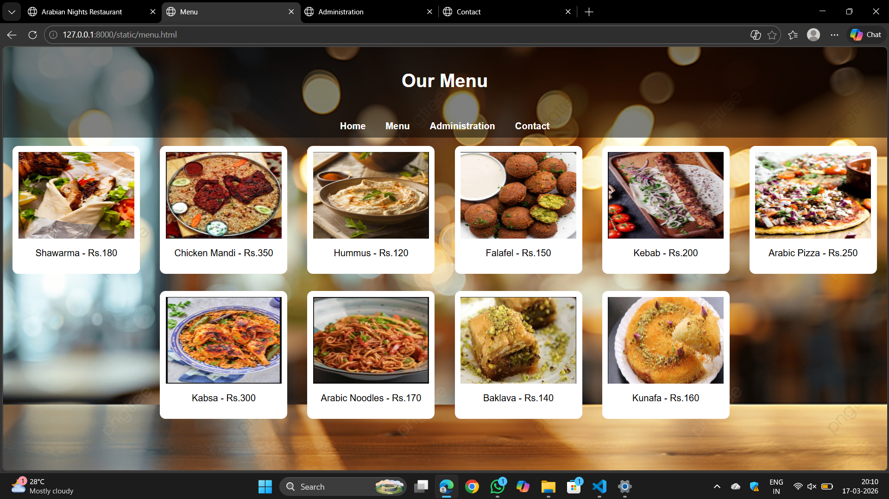
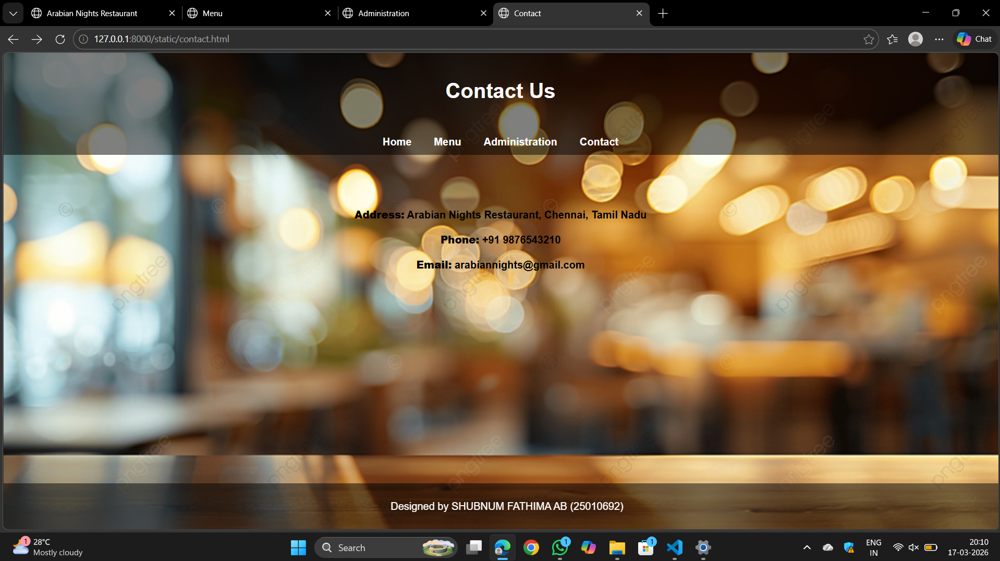

# Ex.06 Restaurant Website
## Date:15/03/2026

## AIM:
To develop a static Restaurant website to display the food items and services provided by them.

## DESIGN STEPS:

### Step 1:
Requirement collection.

### Step 2:
Creating the layout using HTML and CSS.

### Step 3:
Updating the sample content.

### Step 4:
Choose the appropriate style and color scheme.

### Step 5:
Validate the layout in various browsers.

### Step 6:
Validate the HTML code.

### Step 7:
Publish the website in Localhost.

## PROGRAM:
```
home.html
<html>
<head>
<title>Arabian Nights Restaurant</title>

<style>

body{
margin:0;
font-family:Arial;
background-image:url("bg1.png");
background-size:cover;
color:white;
text-align:center;
}

header{
background:rgba(0,0,0,0.5);
padding:20px;
}

nav{
background:rgba(0,0,0,0.5);
padding:10px;
}

nav a{
color:white;
margin:15px;
text-decoration:none;
font-weight:bold;
}

.content{
margin-top:150px;
background:rgba(0,0,0,0.5);
padding:40px;
}

footer{
background:rgba(0,0,0,0.5);
padding:10px;
position:fixed;
bottom:0;
width:100%;
}

</style>
</head>

<body>

<header>
<h1>Arabian Nights Restaurant</h1>
</header>

<nav>
<a href="/">Home</a>
<a href="/menu/">Menu</a>
<a href="/staff/">Administration</a>
<a href="/contact/">Contact</a>
</nav>

<div class="content">
<h2>Welcome</h2>
<p>Enjoy authentic Arabian cuisine with traditional flavours.</p>
</div>

<footer>
<p>Designed by SHUBNUM FATHIMA AB (25010692)</p>
</footer>

</body>
</html>

menu.html
<html>
<head>
<title>Menu</title>

<style>

body{
font-family:Arial;
background-image:url("bg2.png");
text-align:center;
background-size:cover;
margin:0;
}

header{
background:rgba(0,0,0,0.5);
color:white;
padding:20px;
}

nav{
background:rgba(0,0,0,0.5);
padding:10px;
}

nav a{
color:white;
margin:15px;
text-decoration:none;
font-weight:bold;
}

.food{
display:inline-block;
width:200px;
margin:15px;
background:white;
padding:10px;
border-radius:10px;
}

.food img{
width:200px;
height:150px;
}

</style>
</head>

<body>

<header>
<h1>Our Menu</h1>
</header>

<nav>
<a href="/">Home</a>
<a href="/menu/">Menu</a>
<a href="/admin/">Administration</a>
<a href="/contact/">Contact</a>
</nav>

<div class="food">


<p>Shawarma - Rs.180</p>
</div>

<div class="food">

<p>Chicken Mandi - Rs.350</p>
</div>

<div class="food">

<p>Hummus - Rs.120</p>
</div>

<div class="food">

<p>Falafel - Rs.150</p>
</div>

<div class="food">

<p>Kebab - Rs.200</p>
</div>

<div class="food">

<p>Arabic Pizza - Rs.250</p>
</div>

<div class="food">

<p>Kabsa - Rs.300</p>
</div>

<div class="food">

<p>Arabic Noodles - Rs.170</p>
</div>

<div class="food">

<p>Baklava - Rs.140</p>
</div>

<div class="food">

<p>Kunafa - Rs.160</p>
</div>

</body>
</html>

staff.html
<html>
<head>
<title>Administration</title>

<style>

body{
font-family:Arial;
background-image:url("bg2.png");
text-align:center;
margin:0;
background-size:cover;
}

header{
background:rgba(0,0,0,0.5);
color:white;
padding:20px;
}

nav{
background:rgba(0,0,0,0.5);
padding:10px;
}

nav a{
color:white;
margin:15px;
text-decoration:none;
font-weight:bold;
}

.staff{
display:inline-block;
margin:20px;
}

.staff img{
width:120px;
height:120px;
border-radius:25%;
}

</style>
</head>

<body>

<header>
<h1>Administration</h1>
</header>

<nav>
<a href="/">Home</a>
<a href="/menu/">Menu</a>
<a href="/admin/">Administration</a>
<a href="/contact/">Contact</a>
</nav>

<div class="staff">

<p><b>Ahmed - Manager</b></p>
</div>

<div class="staff">

<p><b>Omar - Head Chef</b></p>
</div>

<div class="staff">

<p><b>Layla - Assistant Chef</b></p>
</div>

<div class="staff">

<p><b>Fathima - Service Manager</b></p>
</div>

<div class="staff">

<p><b>Hassan - Cashier</b></p>
</div>

<div class="staff">

<p><b>Yusuf - Waiter</b></p>
</div>

</body>
</html>

contact.html
<html>
<head>
<title>Contact</title>

<style>

body{
font-family:Arial;
background-image:url("bg2.png");
text-align:center;
margin:0;
background-size:cover;
}

header{
background:rgba(0,0,0,0.5);
color:white;
padding:20px;
}

nav{
background:rgba(0,0,0,0.5);
padding:10px;
}

nav a{
color:white;
margin:15px;
text-decoration:none;
font-weight:bold;
}

.contact{
margin-top:80px;
}

footer{
background:rgba(0,0,0,0.5);
color:white;
padding:10px;
position:fixed;
bottom:0;
width:100%;
}

</style>
</head>

<body>

<header>
<h1>Contact Us</h1>
</header>

<nav>
<a href="/">Home</a>
<a href="/menu/">Menu</a>
<a href="/admin/">Administration</a>
<a href="/contact/">Contact</a>
</nav>

<div class="contact">
<p><b><b>Address:</b> Arabian Nights Restaurant, Chennai, Tamil Nadu</b></p>
<p><b><b>Phone:</b> +91 9876543210</b></p>
<p><b><b>Email:</b> arabiannights@gmail.com</b></p>
</div>

<footer>
<p>Designed by SHUBNUM FATHIMA AB (25010692)</p>
</footer>

</body>
</html>

urls.py
from django.urls import path
from . import views

urlpatterns = [
    path('', views.home, name='home'),
    path('menu/', views.menu, name='menu'),
    path('staff/', views.staff, name='staff'),
    path('contact/', views.contact, name='contact'),
]
```

## OUTPUT:





## RESULT:
The program for designing software company website using HTML and CSS is completed successfully.
